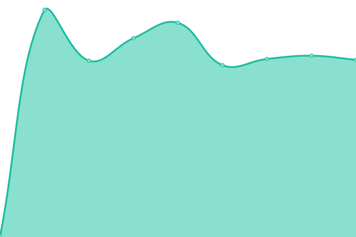

# [📈 Live Status](https://Adrian-Bielefeldt.github.io/S3-3R): <!--live status--> **🟩 All systems operational**

This repository contains the open-source uptime monitor and status page for [Shade](https://Adrian-Bielefeldt.github.io/S3-3R), powered by [Upptime](https://github.com/upptime/upptime).

With [Upptime](https://upptime.js.org), you can get your own unlimited and free uptime monitor and status page, powered entirely by a GitHub repository. We use [Issues](https://github.com/Adrian-Bielefeldt/S3-3R/issues) as incident reports, [Actions](https://github.com/Adrian-Bielefeldt/S3-3R/actions) as uptime monitors, and [Pages](https://Adrian-Bielefeldt.github.io/S3-3R) for the status page.

<!--start: status pages-->
<!-- This summary is generated by Upptime (https://github.com/upptime/upptime) -->
<!-- Do not edit this manually, your changes will be overwritten -->
<!-- prettier-ignore -->
| URL | Status | History | Response Time | Uptime |
| --- | ------ | ------- | ------------- | ------ |
|  [Tarek ist doof](https://bielefeldt.berlin) | 🟩 Up | [tarek-ist-doof.yml](https://github.com/shade-belisar/S3-3R/commits/HEAD/history/tarek-ist-doof.yml) | 

 706ms
     
 | 

<a href="https://Adrian-Bielefeldt.github.io/S3-3R/history/tarek-ist-doof">99.67%</a>
    

|  [Memos](https://memos.bielefeldt.berlin/explore) | 🟩 Up | [memos.yml](https://github.com/shade-belisar/S3-3R/commits/HEAD/history/memos.yml) | 

 642ms
     
 | 

<a href="https://Adrian-Bielefeldt.github.io/S3-3R/history/memos">99.68%</a>
    

|  [Element](https://element.bielefeldt.berlin/#/welcome) | 🟩 Up | [element.yml](https://github.com/shade-belisar/S3-3R/commits/HEAD/history/element.yml) | 

 647ms
     
 | 

<a href="https://Adrian-Bielefeldt.github.io/S3-3R/history/element">99.80%</a>
    

<!--end: status pages-->

[**Visit our status website →**](https://Adrian-Bielefeldt.github.io/S3-3R)

## 📄 License

- Powered by: [Upptime](https://github.com/upptime/upptime)
- Code: [MIT](./LICENSE) © [Shade](https://Adrian-Bielefeldt.github.io/S3-3R)
- Data in the `./history` directory: [Open Database License](https://opendatacommons.org/licenses/odbl/1-0/)
